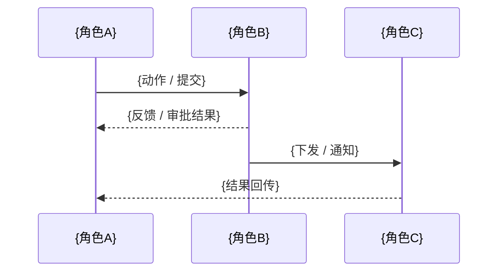

# Discovery V2 BRD 输出模板

使用本模板组织并写入 FlowUS 中的域级 BRD 页面。

这份模板是仓库内的写作辅助，不是最终落地文档。
最终权威内容必须写回当前业务域根页面下的 BRD 页面。

原则：

- 只写已经确认的业务结论
- 未决问题统一进入当前业务域根页面下的页面 `待确认事项`
- 需要暂时保留但尚未验证的判断写入 `关键假设`
- 被明确放弃的路径写入 `已放弃 / 暂缓方案`

需求条目继续使用稳定编号 `REQ-001`、`REQ-002`……

---

```markdown
---
project: {project-name}
domain: {domain-name}
stage: requirements
status: draft
updated: {YYYY-MM-DD}
authors:
  - PM / {name}
  - AI / discovery
---

# 业务需求文档（BRD）：{业务域名称}

## 当前共识

- 这次已经确认的 3-7 个关键结论
- 当前域的边界
- 当前最关键的业务目标

## 一、业务目标与价值

### 1.1 当前做法与痛点

| 当前做法 | 核心痛点 | 业务影响 |
|----------|----------|----------|
| {当前做法} | {具体痛点} | {影响} |

### 1.2 业务目标

| 目标 | 成功指标 | 当前值 | 期望值 |
|------|----------|--------|--------|
| {目标} | {指标} | {当前} | {期望} |

## 二、干系人与用户角色

### 2.1 干系人地图

| 部门/单位 | 角色 | 关注点 | 参与方式 |
|-----------|------|--------|----------|
| {部门} | {岗位/角色} | {关注点} | 决策/使用/审批/被通知 |

### 2.2 关键角色说明

#### {角色名称}

- 岗位：{岗位}
- 日常职责：{职责}
- 核心诉求：{诉求}
- 当前痛点：{痛点}

## 三、核心场景与业务流程

> 先列全域的场景 / 流程总览，再逐条展开高优先项。

### 3.1 场景 / 流程总览

| 序号 | 场景 / 流程名称 | 类型 | 发起角色 | 完成标志 | 优先级 |
|------|------------------|------|----------|----------|--------|
| 1 | {流程名} | 主流程 / 支线 / 异常 | {角色} | {完成标志} | P0/P1/P2 |

### 3.2 流程详情

#### 流程：{流程名称}

触发条件：{谁在什么场景下发起}

流程图（复杂流程建议补充）：

```mermaid
flowchart TD
    Start([触发：{触发条件}]) --> Step1["{步骤1}"]
    Step1 --> Step2["{步骤2}"]
    Step2 --> Approve{"{审批 / 判断节点}"}
    Approve -->|通过| Step3["{后续步骤}"]
    Approve -->|驳回| Reject["{驳回处理}"]
    Reject --> Step1
    Step3 --> End([流程结束])
```

正常路径：

| 步骤 | REQ | 操作人 | 动作 | 输入/填写内容 | 输出/结果 |
|------|-----|--------|------|---------------|-----------|
| 1 | REQ-001 | {角色} | {动作} | {输入} | {输出} |

审批 / 确认节点：

| 环节 | 审批人 / 确认人 | 判断依据 | 通过后 | 驳回后 |
|------|------------------|----------|--------|--------|
| {环节} | {角色} | {条件} | {走向} | {走向} |

跨角色协作图（涉及多角色顺序配合时补充）：



异常处理：

| REQ | 异常场景 | 处理方式 |
|-----|----------|----------|
| REQ-xxx | {异常} | {处理方式} |

## 四、业务规则与约束

### 4.1 关键规则

| REQ | 规则名称 | 规则逻辑 | 适用场景 |
|-----|----------|----------|----------|
| REQ-xxx | {规则名} | {逻辑} | {场景} |

### 4.2 状态流转

状态图（状态较复杂时补充）：

```mermaid
stateDiagram-v2
    [*] --> {初始状态}
    {初始状态} --> {处理中}: {触发条件}
    {处理中} --> {已完成}: {完成条件}
    {处理中} --> {已驳回}: {驳回条件}
    {已驳回} --> {处理中}: {重提条件}
```

| 对象 | 当前状态 | 可进入状态 | 限制说明 |
|------|----------|------------|----------|
| {对象} | {状态} | {状态} | {说明} |

### 4.3 编码 / 命名规则

| 对象 | 规则 | 示例 |
|------|------|------|
| {对象} | {规则} | {示例} |

## 五、业务对象与信息

> 先列对象总览，再逐个展开核心对象、关键单据和数据来源。

### 5.1 对象总览

| 序号 | 对象名称 | 类型 | 作用 | 优先级 |
|------|----------|------|------|--------|
| 1 | {对象} | 主对象 / 从属对象 / 参考对象 | {作用} | P0/P1/P2 |

### 5.2 核心业务对象

对象关系图（对象较多时补充）：

```mermaid
erDiagram
    {对象A} ||--o{ {对象B} : "{关系}"
    {对象A} ||--o{ {对象C} : "{关系}"
```

| 对象名称 | 关键属性 | 与其他对象关系 |
|----------|----------|----------------|
| {对象} | {关键属性} | {关系} |

### 5.3 核心单据与报表

| 类型 | 名称 | 用途 | 使用角色 |
|------|------|------|----------|
| 单据/报表 | {名称} | {用途} | {角色} |

### 5.4 数据来源与迁移

| 数据来源 | 数据内容 | 数据量 | 当前介质 |
|----------|----------|--------|----------|
| {来源} | {内容} | {数量级} | Excel/旧系统/纸质等 |

## 六、跨域协作与外部依赖

> 先列依赖总览，再逐条展开关键链路和高风险依赖。

### 6.1 依赖总览

| 序号 | 依赖对象 | 类型 | 输入 / 输出 | 优先级 | 说明 |
|------|----------|------|-------------|--------|------|
| 1 | {域名 / 系统 / 单位} | 上游域 / 下游域 / 外部系统 / 外部协作方 | {内容} | P0/P1/P2 | {说明} |

### 6.2 跨域依赖

链路总览图（跨域关系复杂时补充）：


| 方向 | 关联域 | 数据 / 动作 | 说明 |
|------|--------|-------------|------|
| 其他域 -> 本域 | {域名} | {输入} | {说明} |
| 本域 -> 其他域 | {域名} | {输出} | {说明} |

### 6.3 外部系统 / 协作方

| 对接方 | 交互内容 | 方式 | 频率 | 说明 |
|--------|----------|------|------|------|
| {系统/单位} | {内容} | 接口/手工/文件 | 实时/按需/周期 | {说明} |

## 七、范围与优先级

### 7.1 优先级

| 优先级 | 内容 | 原因 |
|--------|------|------|
| P0 | {内容} | {原因} |
| P1 | {内容} | {原因} |
| P2 | {内容} | {原因} |

### 7.2 时间约束

| 节点 | 日期 | 硬性 / 弹性 | 原因 |
|------|------|-------------|------|
| {节点} | {日期} | {类型} | {原因} |

### 7.3 已知风险

| 风险 | 影响 | 应对思路 |
|------|------|----------|
| {风险} | {影响} | {应对} |

## 关键假设

- {暂时接受但尚未验证的判断}

## 已放弃 / 暂缓方案

- {讨论过但当前不采用的路径，附简短原因}

## 下一步重点确认

- {下一轮最值得继续确认的块}

> `待确认事项` 不放在 BRD 正文内，而是作为 FlowUS 中挂在当前业务域根页面下的独立页面维护。
```
