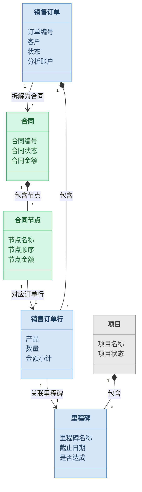

# 业务建模与类图规范

> 供方案设计 Phase 3.3 核心模型设计参考

---

## 建模原则

Odoo 本质是单据系统，所有业务最终都落在单据上。建模时围绕"单据"展开：
- 每个业务实体 = 一个模型
- 实体之间的关系 = 模型关系字段
- 单据的生命周期 = 状态机

---

## 分层绘制

类图分两层，服务不同受众：

### 业务层类图（给 PM 和客户看）

- 使用中文实体名称
- 只放业务核心字段（不超过 5-8 个）
- 标注关系的业务含义
- 不包含技术细节
- **不放方法**

### 技术层类图（给研发看）

在业务层基础上叠加：
- Odoo 模型技术名（如 `sale.order`）
- 字段技术类型（`Many2one`、`One2many`、`Many2many`、`Char`、`Float` 等）
- `_inherit` 还是 `_name`（继承还是新建）
- `compute` 字段及其依赖
- 关键业务方法（跨模型触发方法，通常 3-5 个）

**方案设计阶段画业务层类图即可。** 技术层类图留到 TRD 阶段。

---

## 颜色约定

| 颜色 | 含义 | 说明 |
|------|------|------|
| 灰色 | 原生模型，不修改 | 仅作为关系参考出现在图中 |
| 蓝色 | 原生模型，需要继承扩展 | 通过 `_inherit` 添加字段或方法 |
| 绿色 | 新建模型 | 全新的 `_name` 定义 |

Mermaid 样式：
```
style ModelName fill:#e8e8e8,stroke:#888888,color:#333333   %% 灰色-原生不改
style ModelName fill:#d4e6f9,stroke:#4a86c8,color:#1a3a5c   %% 蓝色-继承扩展
style ModelName fill:#d5f5e3,stroke:#27ae60,color:#1a5c2e   %% 绿色-新建
```

---

## 字段取舍

类图中应放的字段：
- 所有关系字段（`Many2one`、`One2many`、`Many2many`）
- 状态字段（`state`、`stage_id`）
- 关键业务字段（`name`、`amount`、`date` 等）
- 你要新增或修改的字段

不放的字段：
- 系统自带字段（`create_uid`、`write_date` 等）
- 审计字段（`message_ids`、`activity_ids` 等）
- 与当前主题无关的原生字段

---

## 关系标注

每条关系线必须标注：
- 基数（`1` 和 `*`）
- 业务含义（用中文短语）

```
SaleOrder "1" --> "*" Contract : 拆解为合同
```

关系类型翻译表：

| A 有几个 B | B 有几个 A | 关系类型 |
|-----------|-----------|---------|
| 多个 | 1个 | One2many / Many2one |
| 多个 | 多个 | Many2many |
| 1个 | 1个 | Many2one（带唯一约束）|

---

## 模型来源对照表

画完类图后必须输出：

| 模型 | 技术名 | 来源 | 改动方式 | 改动内容 |
|------|-------|------|---------|---------|
| [中文名] | [技术名] | 原生/新建 | _inherit/_name/不改 | [具体改了什么] |

---

## 示例：业务层类图



---

## 联动逻辑标注

类图只表达静态关系。跨模型的动态联动需要额外标注：

```
任务.stage_id 变更（全部完成）
  → compute → 里程碑.is_reached = True
    → trigger → 订单行确认收入
      → 分析账户记录收入
```

跨模块联动必须标注，这是最容易出 bug 的地方。
