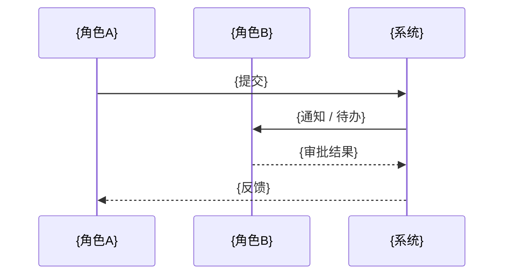

# Solution 输出模板

使用本模板组织并写入 FlowUS 中当前业务域根页面下的 `Solution` 页面。

这份模板是仓库内的写作辅助，不是最终落地文档。
最终权威内容必须写回当前业务域根页面下的 `Solution` 页面。

原则：

- 只写已经确认的方案结论
- 方案结论优先建立在官方文档、模块研究和顾问建议上
- 未决问题统一进入当前业务域根页面下的页面 `待确认事项`
- 需要暂时保留但尚未验证的判断写入 `关键假设`
- 被明确放弃的路径写入 `已放弃 / 暂缓方案`
- GAP 条目保持稳定编号 `GAP-1`、`GAP-2`……

---

````markdown
# 解决方案（Solution）：{业务域名称}

## 当前共识

- 当前已经确认的 3-7 个方案结论
- 当前域的核心落地方向
- 当前最关键的方案边界

## 一、方案目标与设计原则

### 1.1 方案目标

- {要解决的核心问题}
- {本方案服务的业务目标}

### 1.2 设计原则

- 优先使用 Odoo 官方标准能力
- 优先顺着 Odoo 心智模型设计流程和对象
- 官方不足时，再评估 OCA / 社区模块
- 仍不能覆盖时，再做必要定制

## 二、研究依据摘要

### 2.1 官方能力查证

| 模块 | 核心能力 | 关键边界 | 结论 |
|------|----------|----------|------|
| {模块} | {能力} | {边界} | 可直接用 / 部分可用 / 不适合 |

### 2.2 OCA / 社区模块研究

| 模块 | 来源 | 功能概述 | 维护状态 | 建议 |
|------|------|----------|----------|------|
| {模块} | OCA / 第三方 | {概述} | {状态} | 推荐 / 备选 / 谨慎 |

### 2.3 专家补充意见摘要

| 来源 | 主题 | 关键建议 | 对方案的影响 |
|------|------|----------|--------------|
| 行业顾问 / 公司顾问 | {主题} | {建议} | {影响} |

## 三、模块组合蓝图

### 3.1 模块组合

| 模块 | 类型 | 用途 | 覆盖的需求范围 |
|------|------|------|----------------|
| {模块名} | 官方 / OCA / 定制 | {用途} | {范围} |

### 3.2 模块依赖图

```mermaid
graph TD
    A[{模块A}] --> B[{模块B}]
    A --> C[{模块C}]
```

## 四、核心模型设计

> 业务层建模规范见 `references/modeling-guide.md`。

### 4.1 模型来源对照表

| 模型 | 新建 / 继承 | 业务含义 | 关键字段 | 改动内容 |
|------|-------------|----------|----------|----------|
| {模型} | {方式} | {含义} | {关键字段} | {改动} |

### 4.2 业务层类图

```mermaid
classDiagram
    class 实体A["{实体A}"] {
        {字段1}
        {字段2}
    }
    class 实体B["{实体B}"] {
        {字段1}
    }

    实体A "1" --> "*" 实体B : {关系}
```

### 4.3 关键联动逻辑

```text
{触发动作}
  → {联动逻辑}
    → {结果}
```

## 五、业务流程系统映射

### 5.1 流程映射总览

| 流程 | 涉及模型 | 关键角色 | 系统动作 | 说明 |
|------|----------|----------|----------|------|
| {流程} | {模型} | {角色} | {动作} | {说明} |

### 5.2 核心流程图

```mermaid
flowchart LR
    A[{角色A动作}] --> B[{系统对象}]
    B --> C{{判断 / 自动动作}}
    C --> D[{后续结果}]
```

### 5.3 跨角色协作图（如涉及）



## 六、数据流与跨域交互

### 6.1 数据流设计

```text
{来源} → {模块 / 模型} → {后续模块 / 模型} → {输出}
```

### 6.2 跨域交互

| 方向 | 关联域 / 系统 | 数据 / 动作 | 说明 |
|------|----------------|-------------|------|
| 其他域 -> 本域 | {对象} | {输入} | {说明} |
| 本域 -> 其他域 | {对象} | {输出} | {说明} |

## 七、需求-模块映射

| # | BRD 需求摘要 | 覆盖等级 | Odoo 模块 / 功能 | 说明 |
|---|-------------|----------|------------------|------|
| 1 | {需求} | 🟢 | {模块.功能} | {说明} |
| 2 | {需求} | 🟡 | {模块.功能} + 配置 / 轻定制 | {说明} |
| 3 | {需求} | 🔵 | OCA {模块名} | {说明} |
| 4 | {需求} | 🔴 | 定制开发 | {原因} |

## 八、GAP 分析

### 8.1 🟡 部分覆盖（需配置 / 轻定制）

#### GAP-1：{标题}

- 需求：{BRD 需求}
- 现状：{官方 / 模块目前能做到什么}
- 差距：{差距}
- 建议方案：{补法}
- 改动量评估：小 / 中 / 大

### 8.2 🔴 不覆盖（需定制开发）

#### GAP-N：{标题}

- 需求：{BRD 需求}
- 现状：无对应标准功能
- 建议方案：{定制思路}
- 复杂度评估：低 / 中 / 高
- 涉及范围：{模型 / 视图 / 工作流 / 接口...}

### 8.3 🔵 社区模块

| OCA 模块 | 仓库 | 功能 | 质量评估 | 建议 |
|----------|------|------|----------|------|
| {模块名} | {仓库} | {功能} | {维护状态} | 推荐 / 备选 / 谨慎 |

## 九、专家补充意见

### 9.1 行业顾问建议

- {建议}

### 9.2 公司制度 / 规范建议

- {建议}

## 十、定制开发总览

| # | 定制项 | 复杂度 | 优先级 | 说明 |
|---|--------|--------|--------|------|
| 1 | {定制内容} | 高 / 中 / 低 | P0 / P1 / P2 | {说明} |

## 十一、推荐实施路径

- {推荐顺序}
- {先验证的高风险点}
- {阶段划分}

## 关键假设

- {暂时接受但尚未验证的判断}

## 已放弃 / 暂缓方案

- {讨论过但当前不采用的路径，附简短原因}

## 下一步重点确认

- {下一轮最值得继续确认的块}

> `待确认事项` 不放在 `Solution` 正文内，而是作为 FlowUS 中挂在当前业务域根页面下的独立页面维护。
````
