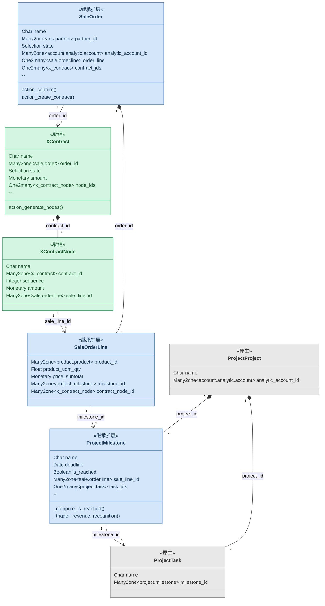

# 业务建模与类图规范（技术层）

> 供 `trd` 在模块规划阶段绘制技术层类图参考。
> 业务层类图规范见 `solution/references/modeling-guide.md`。

---

## 分层定位

| 层级 | 阶段 | 受众 | 内容 |
|------|------|------|------|
| 业务层类图 | 方案设计 | PM、客户 | 中文名称、核心字段、关系含义 |
| 技术层类图 | TRD | 研发、AI | Odoo 技术名、字段类型、`_inherit / _name`、关键方法 |

TRD 阶段在方案设计的业务层类图基础上，叠加技术细节。

---

## 颜色约定

| 颜色 | 含义 | 说明 |
|------|------|------|
| 灰色 | 原生模型，不修改 | 仅作为关系参考出现在图中 |
| 蓝色 | 原生模型，需要继承扩展 | 通过 `_inherit` 添加字段或方法 |
| 绿色 | 新建模型 | 全新的 `_name` 定义 |

Mermaid 样式：

```text
style ModelName fill:#e8e8e8,stroke:#888888,color:#333333
style ModelName fill:#d4e6f9,stroke:#4a86c8,color:#1a3a5c
style ModelName fill:#d5f5e3,stroke:#27ae60,color:#1a5c2e
```

---

## 技术层类图内容要求

### 类的上半部分：字段

应放的字段：

- 所有关系字段
- 状态字段
- 关键业务字段
- 新增或修改的字段
- 关键 `compute` 字段

不放的字段：

- 系统自带字段
- 审计字段
- 与当前主题无关的原生字段

### 类的下半部分：方法

只放跨模型的触发方法，通常 3 到 5 个：

- 状态转换按钮方法
- 跨模型创建 / 触发方法
- 关键 `compute` 方法

不放的方法：

- 模型内部辅助方法
- 标准 CRUD 覆写，除非包含重要业务逻辑
- 普通 `onchange`，除非触发跨模型联动

### 类的标注

每个类必须标注继承方式：

```text
<<继承扩展>>
<<新建>>
<<原生>>
```

### 关系线标注

每条关系线必须标注：

- 基数
- 技术字段名

组合关系用 `*--`，普通关联用 `-->`。

---

## 完整示例



---

## 模型来源对照表

技术层类图画完后，必须输出：

| 模型 | 技术名 | 来源 | 改动方式 | 改动内容 |
|------|--------|------|----------|----------|
| {中文名} | `{技术名}` | 原生 / 新建 | `_inherit / _name / 不改` | {说明} |

---

## 联动逻辑标注

跨模型的动态联动必须单独标注。

### compute 依赖链

```text
{触发事件}
  → compute → {目标模型.目标字段}
    → trigger → {后续动作}
```

### 跨模型触发

```text
{入口方法}
  → {创建 / 更新 / 调用}
    → {后续联动}
```

跨模块联动是最容易出 bug 的地方，必须在 `TRD` 中完整标注。
